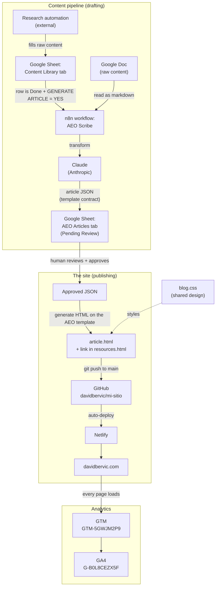

# Architecture

This document is the mental model of the whole system: how a piece of content becomes a
published, tracked page. It is deliberately a small system with clear boundaries.

There are three parts:

1. **The site** — plain static HTML, hosted on Netlify.
2. **The content pipeline** — a Google Sheet + an n8n workflow + Claude that drafts articles.
3. **Analytics** — GTM and GA4 on every page.

---

## Data flow

Follow one article from raw research to a live, tracked page:

The key idea: **content is drafted by machines, but a human approves before anything is
published**, and publishing is just a git push.

---

## Part 1: The site

Plain static HTML files served as-is. No framework, no build. See the file map in the
[README](README.md#what-is-in-here).

Two kinds of pages:

- **Standalone pages** (`index.html`, `resources.html`, `contact.html`, `downloads.html`)
  each carry their own inline CSS, because their layouts are page-specific.
- **Blog articles** on the AEO template (`what-is-lead-scoring.html`,
  `what-is-engagement-score-hubspot.html`) share a single stylesheet, **`blog.css`**. This
  is the source of truth for article design: change it once and every article updates.
  (`how-to-score-leads-hubspot.html` is an older article that still inlines its CSS.)

### The AEO article template

Every article on the template has the same skeleton, in this order:

1. Category tag + question-format `<h1>`
2. Meta line (author, published, updated, read time)
3. Direct-answer block (a self-contained 40-60 word answer)
4. Key takeaways (3-5 bullets)
5. Collapsible question index (open on desktop, collapsed on mobile)
6. Numbered `<h2>` sections, each phrased as a question, each opening with a 1-2 sentence answer
7. FAQ
8. Related reading + Sources
9. Author box
10. JSON-LD schema in `<head>`: `Article` + `FAQPage` + `BreadcrumbList`

This structure is intentional: it targets Answer Engine Optimization (AEO), where search and
AI engines extract self-contained question/answer pairs. Do not "simplify" it away.

---

## Part 2: The content pipeline

Articles are drafted by an AI pipeline, not written by hand. The pipeline is split across
two Google Sheet tabs on purpose, to keep two different lifecycles separate:

- **`Content Library`** owns the *raw content* lifecycle (research done, ready or not).
- **`AEO Articles`** owns the *article* lifecycle (drafted, reviewed, approved, published).

Flow:

1. A research automation fills `Content Library` rows and links a Google Doc of raw content.
2. The n8n workflow ("AEO Scribe") triggers on rows that are `Done` and flagged
   `GENERATE ARTICLE? = YES` (and not already produced). It reads the linked Google Doc,
   sends it to Claude with the template rules, and gets back a JSON object that matches the
   article contract. It writes a new row to `AEO Articles` with status `Pending Review`.
3. A human reviews the JSON and marks it approved.
4. The approved JSON is turned into a final HTML article on the AEO template and linked in
   `resources.html`.

The JSON contract (fields Claude must return): `title`, `slug`, `tag`, `date_published`,
`meta_description`, `read_time_min`, `direct_answer`, `key_takeaways[]`,
`sections[]` (`question` / `answer` / `body_markdown`), `faq[]` (`q` / `a`), `sources[]`
(`name` / `url`). Visual components (comparison cards, stat blocks) are decided at
HTML-generation time from the content, not encoded in the JSON.

The n8n workflow currently lives only in n8n Cloud. Exporting it into `automation/` is
pending (see [README](README.md#known-issues--pending-work)).

---

## Part 3: Analytics

Google Tag Manager is installed in the `<head>` and `<body>` of every page. **GA4 is loaded
as a tag inside GTM**, not via a separate gtag.js snippet, so there is exactly one Google tag
per page. Adding gtag.js directly would double-count traffic.

- GTM container: `GTM-5GWJM2P9`
- GA4 measurement ID: `G-B0L8CEZX5F`

The contact form (`contact.html`) submits via Netlify Forms and pushes a `lead_submitted`
dataLayer event on success, which GTM can turn into a conversion in GA4.

---

## Boundaries and dependencies

| Concern | Where it lives | Notes |
|---------|----------------|-------|
| Site content + code | This git repo | Source of truth for everything published |
| Hosting + deploy | Netlify | Auto-deploys from `main` |
| Content drafting | n8n Cloud + Google Sheets + Claude | Not in this repo yet |
| Analytics config | GTM + GA4 (Google) | Only the GTM snippet lives in the repo |
| Secrets | n8n / Google / Netlify / analytics | None in the repo. See a future `CREDENTIALS.md`. |
